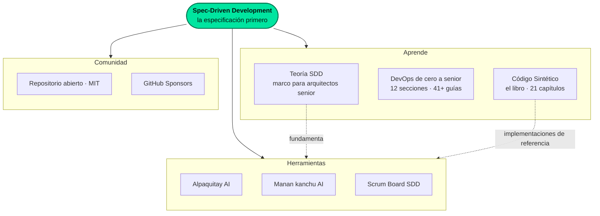
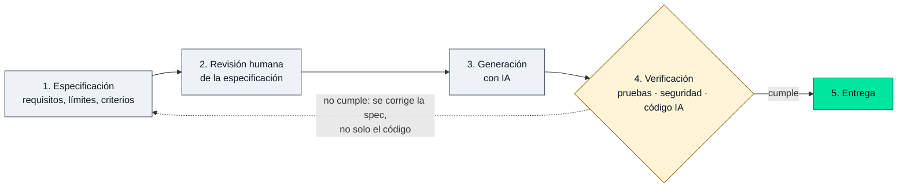

<div align="center">

# SpecSolid

**Laboratorio de ingeniería de software con IA, basado en Spec-Driven Development (SDD).**<br>
Herramientas, currículo abierto de DevOps y un libro para arquitectos senior.

[](https://www.specsolid.com)
[](LICENSE)
[](https://github.com/sponsors/sergioide007)
[](#contribuir)

[**Sitio web**](https://www.specsolid.com) ·
[**Currículo DevOps**](https://devops.specsolid.com/) ·
[**Teoría SDD**](https://ai.specsolid.com/) ·
[**El libro**](https://codigosintetico.specsolid.com/)

</div>

---

## ¿Qué es SpecSolid?

SpecSolid investiga y comparte una forma de construir software cuando la IA escribe parte del código: **escribir primero una especificación precisa**, para que la IA sea un multiplicador predecible y no una apuesta. Todo se publica de forma abierta, con fines educativos y comunitarios, desde Pucallpa, Perú.

> **In short (EN):** SpecSolid is an open engineering lab around Spec-Driven Development: AI tooling, a free DevOps curriculum (12 sections, 41+ guides) and a book on multi-agent systems. This repository contains the source of [specsolid.com](https://www.specsolid.com).

## El ecosistema



### Enlaces directos

| Qué | Para qué sirve | Enlace |
|---|---|---|
| **Sitio principal** | Punto de entrada al laboratorio | [specsolid.com](https://www.specsolid.com) |
| **Teoría SDD** | Marco teórico de Spec-Driven Development | [ai.specsolid.com](https://ai.specsolid.com/) |
| **DevOps de cero a senior** | Currículo abierto, de Linux a ISO 27001 | [devops.specsolid.com](https://devops.specsolid.com/) |
| **Código Sintético** | Libro de 21 capítulos sobre sistemas multiagente | [codigosintetico.specsolid.com](https://codigosintetico.specsolid.com/) |
| **Alpaquitay AI** | Proyecto insignia de investigación | [alpaquitay-ai.specsolid.com](https://alpaquitay-ai.specsolid.com/) |
| **Manan kanchu AI** | Herramienta de la familia SDD | [manan-kanchu-code-ai.specsolid.com](https://manan-kanchu-code-ai.specsolid.com/) |
| **Scrum Board SDD** | Tablero Scrum orientado a especificaciones | [scrum.specsolid.com](https://scrum.specsolid.com/) |

<!-- Autor: confirma que la columna "Para qué sirve" de Alpaquitay, Manan kanchu y Scrum Board describe bien cada herramienta. -->

## Cómo funciona SDD



La idea central: cuando algo falla, se corrige la **especificación** y se vuelve a generar, en lugar de parchear el código a mano.

## Arquitectura y principios

- **Arquitectura:** RAG desacoplado (Retrieval Augmented Generation), arquitectura hexagonal y microservicios.
- **IA explicable (XAI):** SHAP y LIME; orquestación multiagente con n8n y LangChain.
- **Valores:** "Principios sobre tendencias". Seguimos el Manifiesto Ágil y el marco RUN LIDER.

## Estructura del repositorio

Este repositorio es un sitio estático (se publica tal cual, sin proceso de compilación).

```
specsolid/
├── index.html          Página de inicio
├── style.css           Estilos globales (tema oscuro por defecto)
├── tools/              Herramientas
├── architecture/       Arquitectura
├── philosophy/         Filosofía
├── opensource/         Código abierto
├── support/            Soporte
├── shared/             Recursos compartidos (buscador)
├── sitemap.xml         Mapa del sitio para buscadores
├── robots.txt
└── CNAME               Dominio personalizado
```

### Ver el sitio en tu equipo

```bash
git clone https://github.com/sergioide007/specsolid.git
cd specsolid
python3 -m http.server 8000
# abre http://localhost:8000
```

## Contribuir

Las contribuciones son bienvenidas, sobre todo en estas áreas:

- **Diseño y accesibilidad:** estilos, tema claro, contraste, versión móvil.
- **Contenido:** correcciones, traducciones (ES/EN), nuevas guías.
- **SEO:** metadatos, datos estructurados, rendimiento.

Flujo sugerido:

1. Abre un [issue](https://github.com/sergioide007/specsolid/issues) para comentar tu idea, o elige uno existente.
2. Haz un *fork*, crea una rama (`git checkout -b mi-mejora`) y envía un *pull request* pequeño y enfocado.
3. Describe qué cambia y cómo probarlo; si es visual, adjunta una captura.

Para reportar errores de Alpaquitay AI usa su [repositorio](https://github.com/sergioide007/alpaquitay-ai/issues).

## Aviso ético y legal

SpecSolid y Alpaquitay AI son proyectos **sin fines comerciales** de código abierto.

- **Propósito educativo:** el contenido y el código son para educación, investigación y mejora personal.
- **Apoyo:** si te resulta útil, puedes ayudar a mantenerlo con [GitHub Sponsors](https://github.com/sponsors/sergioide007).
- Este proyecto no representa las opiniones ni los servicios de ninguna organización ni afiliación profesional actual de sus colaboradores.

## Licencia

Distribuido bajo la [licencia MIT](LICENSE).

---

<div align="center">

Desarrollado por [Sergio Pérez Ruiz](https://github.com/sergioide007) · Pucallpa, Perú<br>
<sub>Si este trabajo te sirve, una ⭐ ayuda a que más personas lo encuentren.</sub>

</div>
